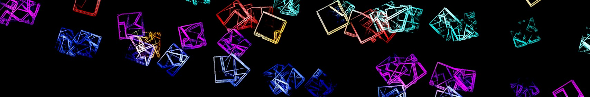

<p align="center">
  
</p>

```
       ______           artdanion
      /     /|          ------------
     /_____/ |          art    ::  media art — MA Interface Cultures
     |     | |          eng    ::  electrical engineering
     |     | /          build  ::  microcontroller · network audio devices · AVB/Milan/UA2.0
     |_____|/           som    ::  RPi CM5 · Radxa CM5 · ESS codecs
                        mcu    ::  ESP32 · XMOS
       ><>              lang   ::  C · C++ · Python · HTML · Java
                        eda    ::  KiCad

> ls /dev/lol            # serious hardware, deeply unserious ideas
  the-scream-of-music    an LRAD that yodels — The Sound of Music, weaponized
  watermap               physical weather data on a table with water drops and maps

> ask me about
  embedded audio · AVB/Milan · PCB design · ESP32 · acoustic mischief

> fun fact
  i'm not the daniel fischer from six feet under
```

---

<p align="center">
  
  
</p>
